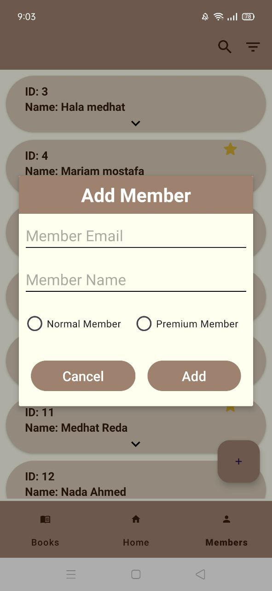

# Library Management System for Android

A powerful **Library Management System** built for Android, designed specifically for library managers. This app helps streamline the process of managing books, borrowers, and transactions, providing an easy-to-use mobile interface for efficient library operations.

## Table of Contents
- [About](#about)
- [Features](#features)
- [Screenshots](#screenshots)
- [Technologies Used](#technologies-used)
- [Usage](#usage)
- 

## About

This app is designed exclusively for **library managers** to oversee library operations. The app allows the manager to efficiently manage books, borrowers, and book transactions such as lending and returns, all from an Android device.

## Features

- Add, update, and remove books.
- Add, update, and remove member.
- Track books currently loaned out and their due dates.
- Manage borrower details.
- Search for books by title, author, or genre.
- User authentication for managers only.

## screenshots
<table>
  <tr>
    <td></td>
    <td></td>
  </tr>
  <tr>
    <td></td>
    <td></td>
    <td></td>
  </tr>
   <tr>
    <td></td>
    <td></td>
  </tr>
</table>

## Technologies Used

- **Kotlin** – Android app development
- **Room Database** – Local storage for book and borrower data
- **Firebase** – User authentication and cloud features
- **XML** – For UI design
- **Material Design** – Modern UI elements and layout

### Prerequisites

Before you begin, ensure you have met the following requirements:

- Android Studio installed
- JDK 8 or higher
- An Android device or emulator

